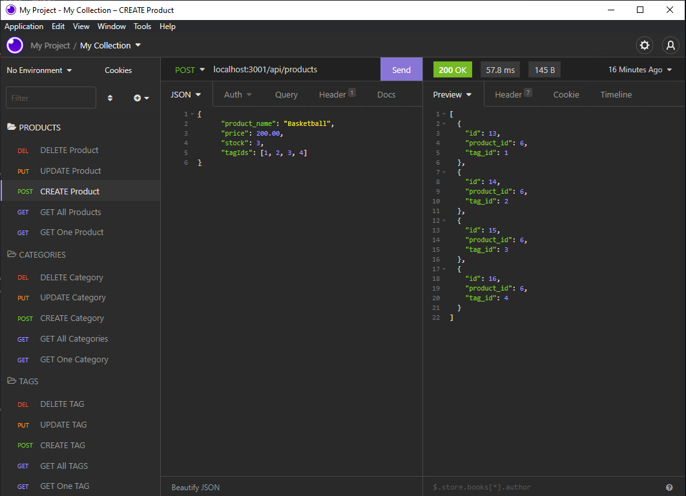

# **
 MoE-CommerceBackEnd 
**

## **Contents**
- [Description](#description)
- [Technologies](#technologies)
- [The Recipe](#the-recipe)
- [License](#license)
- [Improvements](#improvements)
- [Shout Outs](#shout-outs)
- [Screen Shot](#screen-shot)
- [Links](#links)

 

## **Description**
Basic E-Commerce backend using sequelize, express and MySQL
  
Application is executed through node.js and can be tested through insomnia

## **Technologies**
- JavaScript
- Node.js, MySQL
- npm dependencies: dotenv, express, sequelize, mysql
- Computer

## **The Recipe**
1. Clone this repo to the location of your choice
2. Create a new file called `.env` in the root folder
3. Copy and paste the text in the `.env.EXAMPLE` file into the `.env` file you just created
4. Add your MySQL username and password
5. Open your command terminal in the root folder of the repo
6. Run `npm install`
7. Run `mysql -u YOURmysqlusername -p` and type in your password  
P.S. replace `YOURmysqlusername` with your ACTUAL MySQL username
8. Run `SOURCE ./db/schema.sql;` to create the e-commerce database
9. Run `quit` and MySQL should wish you bye
10. Run `npm run seed` to seed some data into the database (you can alter/add your own)
11. Run `npm start` to execute the app on localhost
12. Keep terminal open and open Insomnia
13. Then you can view, create, update and delete products, categories and tags using the routes

## **Improvements**

Maybe add the specific response.json for success/errors and a console log if a route fails

## **License**

MIT License, do what you want.  
The only crime that could possibly be comitted here would be actually using this note taker

## **Shout Outs**

Shout out to the real MVP, Stack Overflow

## **Screen Shot**

## **Links**

